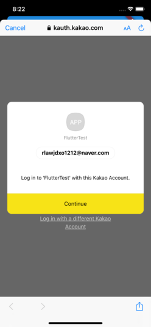

# kakao_sdk_sample

Kakao SDK 를 이용하여 Kakao 로그인 테스트

## 실행화면

### Home

### Kakao talk 설치 확인

### Kakao Login

|#1|#2|#3|#4|
|---|---|---|---|
|||||

## SDK

[Link](https://pub.dev/packages/kakao_flutter_sdk)

## Check List

- [x] Test Android
- [x] Test iOS